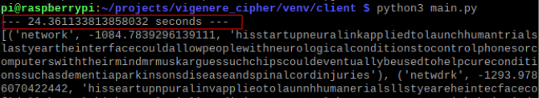
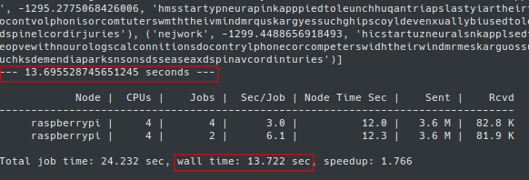

# Distributed Vigenere Crack

This project utilizes a cluster of machines to crack the vigenere cipher. 
The approach yields a near 50% reduction on cracking time with two servers and one client.

## Dependencies
1. Virtualenv
2. Dispy
3. psutil

2x Raspberry Pi 4Bs were used (as servers) alongside one desktop machine (client). 

## Installation 

1| Install virtualenv and then create a virtual environment.

`pip3 install virtualenv`

`python3 -m virtualenv venv_name`

2| Pull repo and install the other dependencies within the virtual environment.

`cd venv_name/` 

`git pull origin master`

`./install`

#### Server

3| Run the server shell script.

`cd server/`

`./start_dispynode.sh`

#### Client

3| Enter into the client directory.

`cd client/`

4| Run controller.py inputting your ciphertext and key length

`python3 controller.py <ciphertext> <key length>`

Info on the additional network configurations needed to be made can be found at: https://projects.raspberrypi.org/en/projects/build-an-octapi/4

## Results
Single node 

----
Multi node

